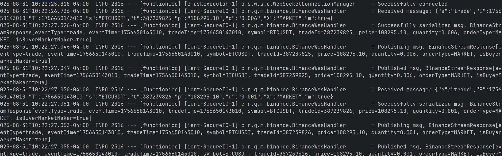

# Market Listener

## Summary

This application's goal is to listen live market data through a websocket
seralize it and send it to a kafka topic.
___

## Running the application

This application requires a kafka connection; in order to successfully send the Message.
<br/>
Follow the steps outlined here [Kafka Quickstart](https://kafka.apache.org/quickstart)
<br/>

In order to run the application

```bash
mvn spring-boot:run -Dspring-boot.run.profiles=local
```

When applicaiton is running properly we should see

in the console
___

## Architecture

```
Market Data Source → WebSocket Client → Event Publisher → Kafka Producer → Kafka Topic
```

1. **WebSocket Listener:** Connects to market data providers (exchanges, data feeds)
2. **Event Publisher:** Uses Spring Events to decouple WebSocket handling from message processing
3. **Message Serializer:** Converts market data to standardized format (JSON/Avro)
4. **Kafka Producer:** Publishes serialized messages to configured Kafka topics

___

## Tech stack

* **Java 21** - Latest LTS version for optimal performance and modern language features
* **Spring Boot 3.x** - Application framework with auto-configuration and production-ready features
* **Spring Events** - Decoupled event-driven architecture for internal messaging
* **WebSockets** - Real-time bidirectional communication for market data streaming
* **Apache Kafka** - Distributed streaming platform for reliable message queuing
* **Maven 3.6.5+** - Dependency management and build automation
* **Jackson** - JSON serialization/deserialization
* **SLF4J + Logback** - Structured logging framework

___

## Troubleshooting

### Common Issues

* WebSocket Connection Fails
    * Verify market data source URL and authentication
    * Check network connectivity and firewall rules
    * Review WebSocket client logs for detailed errors

* Kafka Publishing Errors
    * Ensure Kafka cluster is running and accessible
    * Verify topic exists and has correct permissions
    * Check serialization configuration

* High Memory Usage
    * Tune JVM heap settings: -Xmx2g -Xms1g
    * Review message buffering configuration
    * Monitor for memory leaks in WebSocket handlers