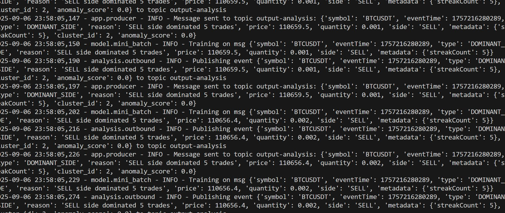

# Market Analysis

---

### Summary

This application’s goal is to consume enriched market events (signals, anomalies, metrics) from Kafka, apply **unsupervised learning** techniques to detect patterns or anomalies, and publish insights back into Kafka topics for downstream consumers.

Key features include:

- **Clustering with MiniBatchKMeans:** Incrementally trains on incoming market events to discover evolving patterns in trade flow.
- **Anomaly Detection:** Identifies signals that fall far outside of cluster norms → emits AnomalyEvent.
- **Adaptive Learning:** Continuously updates clusters as new data streams in, enabling detection of regime shifts in trading behavior.

---

## Running the application

Prerequisites

- Python 3.11+
- A running Kafka cluster accessible at `localhost:9092`.
- Enriched events being published by upstream services such as Market Transformer.
- Python dependencies installed:

```bash
python -m pip install -r requirements.txt
```

Run locally

```bash
python run.py
```

On Windows PowerShell, if `python` is not available:

```powershell
py run.py
```

When running successfully, you should see logs indicating messages being consumed, clustered, and anomalies being flagged:

```bash
INFO  model.mini_batch - Training on msg {'symbol': 'BTCUSDT', 'type': 'DOMINANT_SIDE', ...}
INFO  model.cluster - Assigned cluster=2 distance=0.08
INFO  app.producer - Publishing AnomalyEvent for symbol=BTCUSDT
```

---

## Architecture

```bash
Kafka Topic (enriched market events) → Kafka Consumer → MiniBatchKMeans Model → Anomaly Detector → Kafka Producer → Kafka Topic (analysis results)
```

1. **Kafka Consumer:** Subscribes to topics like order-signal or market-events.

2. **MiniBatchKMeans Model:** Incrementally fits market events into clusters to detect structure.

3. **Anomaly Detector:** Flags events that deviate significantly from learned clusters.

4. **Kafka Producer:** Publishes anomaly and cluster insight events to downstream topics.

5. **Flask Server:** Lightweight API layer for health checks, monitoring, and optional interactive queries.

---

## Tech Stack

- **Python 3.11+ –** Modern async/typing features and high performance.

- **Flask –** Lightweight web server for monitoring endpoints.

- **scikit-learn –** MiniBatchKMeans for online unsupervised clustering.

- **Apache Kafka –** Streaming backbone for consuming and publishing events.

- **kafka-python-ng –** Kafka client for fast and reliable message handling.

- **logging –** Structured application logs with INFO/ERROR separation.

---

## Troubleshooting

### Common Issues

- **n_samples=1 should be >= n_clusters=4**
  - This happens when too few events arrive before clustering.

  - **Fix:** buffer multiple samples before calling partial_fit or lower n_clusters.

- **Kafka Consumer/Producer Errors**
  - Ensure Kafka is running and reachable.

  - Verify correct topic names and authentication configs.

- **Model Not Updating**
  - Confirm events are reaching the consumer (check logs).

  - Ensure partial_fit is called with valid feature vectors.

- **High CPU/Memory Usage**
  - Reduce batch_size in MiniBatchKMeans.

  - Tune the number of clusters (n_clusters) to avoid overfitting.

  - Scale horizontally with more consumers in the group.


