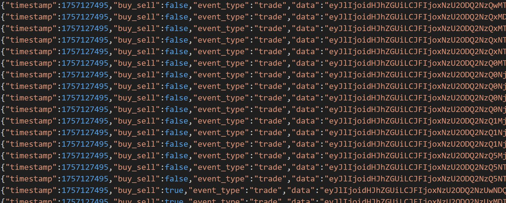
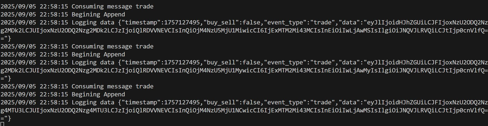

# Market Append-Only Log

## Summary

<br/>
This service consumes raw trade events from a Kafka topic and writes them to an append-only log file on disk.
It is designed to be a durable ledger of all received market events for downstream processing or auditing.

## Key responsibilities

* **Kafka Consumer:** Subscribes to a configured topic (e.g., order).

* **Persistence:** Serializes incoming events into JSON and writes them to history.log.

* **Append-Only:** Entries are never modified or deleted — only appended.

## Running the application

### Requirements

A running Kafka cluster (for consuming events).

Topics must exist and contain trade messages (e.g., produced by the Market Listener).

## Run locally

### Run with Go directly

```bash
go run cmd/server/main.go
```

When running successfully, you should see log entries being written to history.log. Example line:

```json
{"timestamp":1693961327,"buy_sell":true,"event_type":"trade","data":"{\"e\":\"trade\",\"E\":1693961327,...}"}
```

### Build binary

```bash
go build -o marketappendonly ./cmd/server
```

### Run the binary

```bash
./marketappendonly
```

### Build Docker image

```bash
docker build -t marketappendonly .
```

### Run the container

```bash
docker run --rm -v $(pwd):/root marketappendonly
```

This will mount the current directory so that history.log is written locally.

## Architecture

```
Kafka Topic (trades) → Go Kafka Consumer → Append-Only Log File (history.log)
```

* **Kafka Consumer (Sarama):** Connects to localhost:9092 by default and consumes messages from the order topic.

* **Log Writer:** Wraps each consumed message in a log entry with timestamp, trade side, and event type.

* **File Output:** Appends entries to history.log (newline-delimited JSON).

## Tech Stack

* **Go 1.24.+** – Minimal, efficient runtime for services

* **Sarama –** Pure Go Kafka client for consumption

* **JSON –** Simple serialization for persisted log records

## Troubleshooting

### Common Issues

* No messages consumed

  * Verify Kafka is running (localhost:9092).

  * Ensure the topic order exists and contains messages.

  * Check consumer group offsets — if set to latest, older messages will not replay.

* No log file output

  * Ensure the process has write permissions to the working directory.

  * Verify history.log is not mounted read-only inside Docker.

* Container exits immediately

  * Check for missing Kafka connection.

  * Confirm environment variables (if configured later for brokers/topics).

## Screenshots




