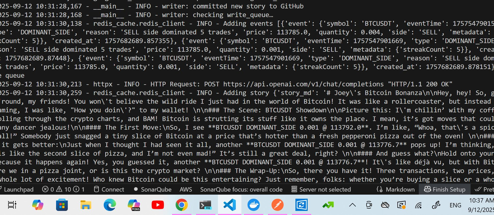

# Market Bard

## Prerequisites

- Python 3.11+
- A running Kafka cluster for incoming events
- RabbitMQ accessible at `localhost:5672`
- A `.env` file containing `OPENAI_API_KEY` and `GITHUB_TOKEN`

```bash
pip install -r requirements.txt
```

---

## Summary

**MarketBard** is a storytelling pipeline for live market events.
It consumes enriched events from Kafka, buffers them through RabbitMQ, transforms batches into LLM-generated **Markdown stories**, and finally commits those stories to GitHub when ready.

Key features include:

- **Kafka Integration:** Subscribes to upstream market event topics.

- **RabbitMQ Event Buffer:** Temporarily stores incoming events for story generation.

- **Prompt-Engineered Storytelling:** Aggregates events into a prompt and generates a structured Markdown story via LLM.

- **RabbitMQ Story Buffer:** Holds completed stories until a batch threshold is reached.

- **GitHub Writer:** Commits finalized .md files into a GitHub repository for persistence or publishing.

---

## Running the application

Prerequisites

- A running Kafka cluster accessible at `localhost:9092`.
- Redis running on `localhost:6379`.
- A `.env` file containing `OPENAI_API_KEY` and `GITHUB_TOKEN`.
- Python dependencies installed:

```bash
pip install -r requirements.txt
```

Run locally

```bash
python run.py
```

On Windows PowerShell:

```powershell
py run.py
```

When running successfully, you should see logs indicating events being buffered, stories generated, and GitHub commits completed:

```bash
INFO - Updated existing NEWS_UPDATE.MD
INFO - writer: committed new story to GitHub
INFO - writer: checking write_queue...
INFO - Adding events [...] to the queue
```

---



---

## Architecture

```bash
Kafka Topic (market events)
    → Kafka Consumer
        → RabbitMQ Event Queue
            → Story Generator (LLM + prompt)
                → Story Queue
                    → GitHub Writer
                        → GitHub Repo (Markdown stories)

```

1. **Kafka Consumer:** Subscribes to enriched event topics.

2. **RabbitMQ Event Queue:** Buffers raw events until enough context is available.

3. **Story Generator:** Builds a narrative prompt from events and requests Markdown from an LLM.

4. **Story Queue:** Stores completed stories, batching them for commit.

5. **GitHub Writer:** Once the queue threshold is reached, pushes .md files to a GitHub repo.

---

## Tech Stack

- **Python 3.11+ –** Modern async/typing features and high performance.

- **Apache Kafka –** event ingestion and streaming backbone.

- **RabbitMQ –** messaging buffer for events and stories.

- **OpenAI API –** for narrative generation.

- **GitHub API –** story commits to a repo.

- **Logging –** structured INFO/ERROR logs.

---

## Troubleshooting

### Common Issues

- Events not reaching RabbitMQ
  - Confirm Kafka is producing to the expected topic.
  - Verify RabbitMQ is reachable and the queue exists.

- Stories not generating
  - Check that OPENAI_API_KEY is set correctly in `.env`.
  - Ensure events are being consumed from RabbitMQ and moved into story generation.

- Stories never written to GitHub
  - Verify `GITHUB_TOKEN` in `.env` has write access.
  - Check story queue threshold (may need to lower batch size for testing).

- RabbitMQ connection issues
  - Ensure RabbitMQ is running and accessible on `localhost:5672`.

  ```bash
  docker ps
  ```

---

## Final Output


