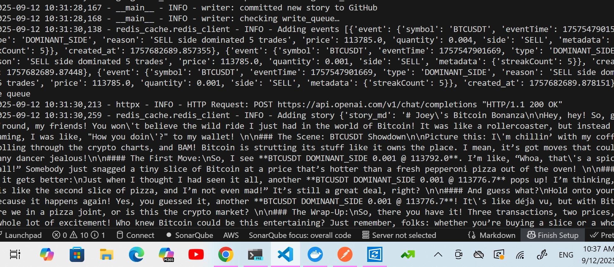

# Market Bard

## Prequirements

```bash
  docker pull redis:latest
  docker run -p 6379:6379 redis
```

___

## Summary

**MarketBard** is a storytelling pipeline for live market events.
It consumes enriched events from Kafka, buffers them into Redis, transforms batches into LLM-generated **Markdown stories**, and finally commits those stories to GitHub when ready.

Key features include:

* **Kafka Integration:** Subscribes to upstream market event topics.

* **Redis Event Buffer:** Temporarily stores incoming events for story generation.

* **Prompt-Engineered Storytelling:** Aggregates events into a prompt and generates a structured Markdown story via LLM.

* **Redis Story Buffer:** Holds completed stories until a batch threshold is reached.

* **GitHub Writer:** Commits finalized .md files into a GitHub repository for persistence or publishing.

---

## Running the application

This application requires:

* Kafka cluster for incoming events.

* Redis for buffering both events and stories.

* GitHub token with repo write permissions stored in .env.

* OpenAI (or compatible LLM) API key in .env.

```bash
python run .py
```

When running successfully, you should see logs indicating messages being consumed, clustered, and anomalies being flagged:

```bash
- INFO - Updated existing NEWS_UPDATE.MD
2025-09-12 10:31:28,167 - __main__ - INFO - writer: committed new story to GitHub
2025-09-12 10:31:28,168 - __main__ - INFO - writer: checking write_queue…
2025-09-12 10:31:30,138 - redis_cache.redis_client - INFO - Adding events [{'event': {'symbol': 'BTCUSDT', 'eventTime': 1757547901547, 'type': 'DOMINANT_SIDE', 'reason': 'SELL side dominated 5 trades', 'price': 113785.0, 'quantity': 0.004, 'side': 'SELL', 'metadata': {'streakCount': 5}}, 'created_at': 1757682689.857355}, {'event': {'symbol': 'BTCUSDT', 'eventTime': 1757547901669, 'type': 'DOMINANT_SIDE', 'reason': 'SELL side dominated 5 trades', 'price': 113785.0, 'quantity': 0.001, 'side': 'SELL', 'metadata': {'streakCount': 5}}, 'created_at': 1757682689.87448}, {'event': {'symbol': 'BTCUSDT', 'eventTime': 1757547901669, 'type': 'DOMINANT_SIDE', 'reason': 'SELL side dominated 5 trades', 'price': 113785.0, 'quantity': 0.001, 'side': 'SELL', 'metadata': {'streakCount': 5}}, 'created_at': 1757682689.878151}] to the queue
2025-09-12 10:31:30,213 - httpx - INFO - HTTP Request: P
```



---

## Architecture

```bash
Kafka Topic (market events) 
    → Kafka Consumer 
        → Redis Event Queue 
            → Story Generator (LLM + prompt) 
                → Redis Story Queue 
                    → GitHub Writer 
                        → GitHub Repo (Markdown stories)

```

1. **Kafka Consumer:** Subscribes to enriched event topics.

2. **Redis Event Queue:** Buffers raw events until enough context is available.

3. **Story Generator:** Builds a narrative prompt from events and requests Markdown from an LLM.

4. **Redis Story Queue:** Stores completed stories, batching them for commit.

5. **GitHub Writer:** Once the queue threshold is reached, pushes .md files to a GitHub repo.

---

## Tech Stack

* **Python 3.11+ –** Modern async/typing features and high performance.

* **Apache Kafka –** event ingestion and streaming backbone.

* **Redis –** lightweight buffer for events and stories.

* **OpenAI API –** for narrative generation.

* **GitHub API  –** story commits to a repo.

* **Logging –** structured INFO/ERROR logs.

---

## Troubleshooting

### Common Issues

* Events not reaching Redis

  * Confirm Kafka is producing to the expected topic.

  * Verify Kafka consumer group/subscription config.

* Stories not generating

  * Check that OPENAI_API_KEY is set correctly in .env.

  * Ensure events are being popped from the Redis event queue.

* Stories never written to GitHub

  * Verify GITHUB_TOKEN in .env has write access.

  * Check story queue threshold (may need to lower batch size for testing).

* Redis connection issues

  * Ensure Redis is running:
  should show a container with port 6379.

  ```bash
  docker ps
  ```

---

## Final Output


