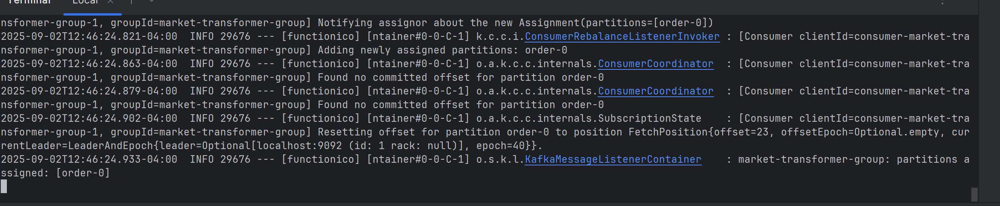

# Market Transformer
___
### Summary

This application's goal is to consume raw market data from the Market Listener, transform it into meaningful events (signals, anomalies, metrics), and publish them to Kafka topics for modular consumption.

Key transformations include:

* **Large trade detected:** If a trade’s quantity is above a certain threshold → emit LargeTradeEvent. 
* **Aggressive buyer/seller:** If the same side dominates for N trades in a row → emit DominantSideEvent. 
* **Price spike/dip**: If price moves more than X% in a short period → emit PriceSpikeEvent or PriceDipEvent.

---
## Running the application

This application requires:

A running Kafka cluster for publishing events. Follow Kafka Quickstart
if needed.

The Market Listener producing raw trade data to Kafka topics.

To run the application locally:
```bash
mvn spring-boot:run -Dspring-boot.run.profiles=local
```

When running successfully, you should see logs indicating events being processed and published:
```bash
INFO  ... LargeTradeDetected: Anomaly detected publishing event
INFO  ... AggressiveBuyerSeller: BUY side dominated 5 trades in a row
INFO  ... PriceSpikeDetected: Price moved 5% from 100 to 10
```
---
## Architecture 
```bash
Kafka Topic (raw market data) → Spring Event Listener → Transformer → Kafka Producer → Kafka Topic (events)

```

1. **Kafka Consumer:** Reads raw trade data from the Market Listener topics.
2. **Transformer:** Implements Spring ApplicationListener<OrderReceived> to detect anomalies or compute metrics.
3. **Event Publisher:** Uses a single KafkaPublisher to produce transformed events to Kafka topics.
4. **Kafka Producer:** Publishes standardized events for downstream services or analytics pipelines.

---
## Tech Stack
* **Java 21 –** Latest LTS version for optimal performance and modern language features
* **Spring Boot 3.x –** Application framework with auto-configuration and production-ready features

* **Spring Events –** Decoupled event-driven architecture for internal messaging

* **Apache Kafka –** Distributed streaming platform for reliable message queuing

* **Maven 3.6.5+ –** Dependency management and build automation

* **Jackson –** JSON serialization/deserialization
* **SLF4J + Logback –** Structured logging framework
---
## Troubleshooting
### Common Issues

* Kafka Consumer/Producer Fails

  * Ensure Kafka cluster is running and accessible

  * Verify topics exist and have proper permissions

  * Check serialization configuration matches the consumer/producer

* Transformer Logic Not Triggering

  * Ensure raw trades meet threshold conditions for each event type

  * Review logs for stateful transformer behavior (streak counters, recent prices, etc.)

* High Memory Usage

  * Tune JVM heap settings: -Xmx2g -Xms1g

  * Review internal lists (e.g., LinkedList for recent prices or sides) to ensure they do not grow unbounded

  * Monitor event throughput and batch processing intervals
